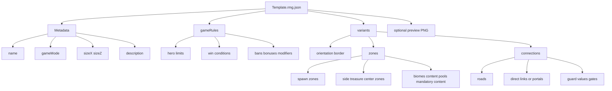
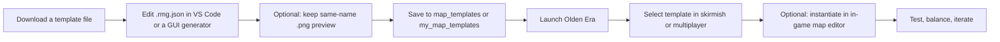

# Heroes of Golden Era Map Templates

## Executive summary

The title in your prompt is ambiguous. In the authoritative sources I reviewed, I did **not** find an official game page using the exact title **“Heroes of Golden Era.”** The game that consistently matches the context—map templates, an in-game editor, random-map generation, competitive template pools, and a current official wiki—is **Heroes of Might and Magic: Olden Era** by Unfrozen and Hooded Horse. I therefore treat your request as referring to **Heroes of Might and Magic: Olden Era** and explicitly note that mapping here. citeturn25view0turn21search8

The strongest evidence base for template research is split between **official sources** and **community download sources**. Official sources confirm that Olden Era already ships with an in-game map editor, uses random-map templates, and plans to add more templates plus editor improvements in the full version. Official patch notes also name many competitive templates directly, including **Jebus Cross, Universe, Infinity, Sand Clover, Arcade, Harmony, Sprint, Exodus, Blitz, Vendetta, and Jebus Outcast**. Public downloadable template files, however, are mostly available through reputable community hubs—especially the **KhanDevelopsGames GitHub repository** and the **AuroraRMG / HoMMDB ecosystem**—rather than through a first-party public template library. citeturn25view0turn20view2turn41view0turn29view2

Across the public files reviewed, the dominant format is **`.rmg.json`**, often accompanied by an **optional same-name `.png` preview** for in-game display. The files expose map canvas in **tile dimensions** via `sizeX` and `sizeZ`, not as pixel-resolution artboards. Structurally, they are **not** layered PSD/TMX-style map templates; they are **JSON random-map definitions** with recurring blocks such as **metadata**, **gameRules**, **variants**, **zones**, and **connections**. The practical consequence is that the best editing workflows today are either **Windows GUI generators/editors** such as **Olden Era Template Editor** and **AuroraRMG**, or **cross-platform JSON editing** in tools such as **VS Code**. citeturn41view0turn27view0turn29view0turn17search0turn18view2

For actual use, the ecosystem currently skews hard toward **skirmish and PvP**, especially official competitive rotations. If you want **authored campaign-style maps**, the official store page makes clear that Olden Era separately distinguishes between **hand-crafted maps/scenarios** and **procedurally generated maps**; the downloadable RMG templates cataloged here belong to the latter category. A useful rule of thumb from the files themselves is that **SingleHero** templates lock hero count to one and typically set `heroHireBan` to `true`, while **Classic** templates allow broader hero counts and lean toward mainstream skirmish/PvP play. citeturn25view0turn34view1turn36view0turn36view1turn37view0turn38view2turn38view1turn35view4turn37view2turn38view0

## Scope and source audit

This report uses a strict source hierarchy. **First**, I rely on official Steam store text, official patch notes, and the official Hooded Horse wiki to establish what the game officially supports: map editor availability, the distinction between hand-crafted and procedural maps, roadmap/editor plans, and the names of templates present in live competitive rotations or patch notes. **Second**, I use major community hubs—primarily the **KhanDevelopsGames GitHub repository**, **Steam Community discussions**, **HoMMDB**, and the **AuroraRMG** thread—for actual public downloads, installation paths, and editor workflows. That split matters because Olden Era’s official channels describe templates, but the community hubs are where the downloadable `.rmg.json` files are easiest to obtain today. citeturn25view0turn20view2turn20view1turn21search8turn41view0turn29view2turn29view0

Officially, Olden Era’s Early Access store page says players can **design their own maps using the map editor**, and the full version is planned to add **additional scenarios and map templates**, improve the **map editor**, and add an **Underground map layer**. The same page distinguishes between **procedurally generated** and **hand-crafted** maps, which is the key reason to separate **RMG templates** from **scenario/campaign maps** in this catalog. citeturn25view0

Official patch notes are especially useful because they anchor template names in live use. The June 2026 patch notes list template-specific balance adjustments for **Arcade, Exodus, Sprint, Harmony, Vendetta, and Jebus Outcast**, and also show official matchmaking pools: **Classic Mode** shifted from **Jebus Cross / Universe / Infinity / Last Fortress / Arcade** to **Jebus Cross / Universe / Infinity / Sand Clover / Arcade**, while **Single Hero Mode** shifted from **Harmony / Sprint / Exodus / Jebus Outcast / Vendetta** to **Harmony / Sprint / Exodus / Blitz / Vendetta**. Earlier notes also state that “all our templates are used by the Random Map Generator” and mention added templates such as **Crossroads** and **Jebus Outcast**. citeturn20view2turn20view1

The main limitation is download provenance. I did **not** find a first-party public repository where the developer or publisher directly hosts all template files as downloadable assets. The best public file pages I found are in the community GitHub repository and related tools. That means the right way to read the catalog below is: **official mention and validation from first-party sources; practical download and editing from reputable community mirrors/utilities**. citeturn20view2turn41view0turn29view2

## Catalog of downloadable templates

For every template in the table below, the publicly downloadable artifact is a **`.rmg.json`** random-map template, usually with an **optional same-name `.png` preview** if you want a nicer browser/selector thumbnail in-game. The reviewed examples appear to depend on **stock Olden Era assets, object/biome IDs, and localization strings** rather than separate external tileset/sprite/font packs. I did **not** find any separate downloadable tileset or font bundle attached to these template files. Licensing is also shared in practice: the **game itself is all-rights-reserved**, while the reviewed community mirror explicitly says it is **not affiliated with or endorsed by the developers** and tells users to **use generated templates at their own risk**, without surfacing a clear reuse grant. citeturn25view0turn27view0turn41view0turn29view0turn38view0turn38view1turn43view1

The “download” link in each row points to a **public GitHub file page** for that template. Those file pages expose a **Raw / Download raw file** action. citeturn11view0turn30view1

| Template | Official validation | Download link | Mode | Canvas | Structural layers and layout pattern | Typical use | Brief note |
|---|---|---|---|---|---|---|---|
| **Arcade** | Officially patched and used in Classic competitive rotation. citeturn20view2 | GitHub file page. citeturn30view1 | **Classic**. citeturn38view0 | **80×80** tiles. citeturn38view0 | Compact **Spawn-A/B → Treasure-A/B → Center** progression with strong central pressure. citeturn40view0 | Short PvP, fast skirmish. citeturn20view2turn38view0 | The smallest high-quality official competitive template I found publicly mirrored; ideal when you want a quick match. citeturn38view0turn20view2 |
| **Blitz** | Officially added to the Single Hero competitive pool. citeturn20view2 | GitHub file page. citeturn31view0 | **SingleHero**. citeturn33view1 | **128×128** tiles. citeturn34view1 | Multi-step rush ladder: **Spawn → Treasure-1 → Side-1 → deeper treasure/supertreasure**. citeturn40view1 | Competitive Single Hero PvP. citeturn20view2turn33view1 | Good for players who want a longer single-hero macro game than Sprint but still a tightly scripted escalation curve. citeturn34view1turn40view1 |
| **Exodus** | Officially tuned in patch notes and maintained in Single Hero rotation. citeturn20view2 | GitHub file page. citeturn31view1 | **SingleHero**. citeturn36view0 | **128×128** tiles. citeturn36view0 | Two-start structure feeding into **treasure lanes** and center-adjacent treasure zones. citeturn39view3 | Single Hero PvP and focused skirmish. citeturn20view2turn36view0 | A strong “progression corridor” map with explicit movement/portal-style rule bonuses in `gameRules`. citeturn36view0 |
| **Harmony** | Officially patched; official note says its size was reduced to **112×112** in a later live version for faster play. citeturn20view2 | GitHub file page. citeturn31view2 | **SingleHero**. citeturn36view1 | Public mirror currently shows **128×128**. The official live patch note reports a later reduction to **112×112**. citeturn36view1turn20view2 | Mirrored **Spawn → Side → Center-A/B** chains with guarded roaded steps. citeturn39view4 | Single Hero PvP. citeturn20view2turn36view1 | This is a good example of why official patch notes matter: downloadable public mirrors can lag behind live balance changes. citeturn36view1turn20view2 |
| **Infinity** | Officially present in Classic competitive rotation. citeturn20view2 | GitHub file page. citeturn31view3 | **Classic**. citeturn37view2 | **112×112** tiles. citeturn37view2 | Mirrored **Spawn → Side → Center** layout with direct roaded links and area-value overrides. citeturn37view2turn39view2 | Competitive PvP, medium-length skirmish. citeturn20view2turn37view2 | A strong middle ground between compact templates and the huge 160×160 maps. citeturn37view2turn20view2 |
| **Jebus Cross** | Officially always included in the Classic pool and explicitly called “popular” in patch notes. citeturn20view2turn21search2 | GitHub file page. citeturn30view6 | **Classic**. citeturn38view1 | **160×160** tiles. citeturn38view1 | Large guarded **center hub** with multiple spoke-like center-to-spawn entrances; classic “Jebus” pressure geometry. citeturn38view1turn39view0 | High-skill PvP, longer macro skirmish. citeturn20view2turn38view1 | If you want a “signature” competitive Olden Era template, this is the one to start with. citeturn20view2turn21search2 |
| **Jebus Outcast** | Officially adjusted in patch notes and formerly present in the Single Hero competitive pool. citeturn20view2 | GitHub file page. citeturn31view4 | **SingleHero**. citeturn35view0 | **160×160** tiles. citeturn35view0 | Huge **center-heavy** Jebus-style map with center-to-spawn guarded spokes plus side-zone proximity variants. citeturn43view0turn43view1 | Long-form Single Hero PvP. citeturn20view2turn35view0 | Best when you want a big single-hero competitive template with a dramatic central fight phase. citeturn35view0turn43view1 |
| **Last Fortress** | Officially in the earlier Classic competitive rotation. citeturn20view2 | GitHub file page. citeturn31view5 | **Classic**. citeturn36view2 | **128×128** tiles. citeturn36view2 | Fortress/chain style: **Spawn → Side-Center nodes → deeper guarded center chain**, with foothold elements. citeturn40view2 | PvP, defensive skirmish. citeturn20view2turn36view2 | Excellent reference template if you want to study how to make guarded center ladders feel more defensive than Jebus Cross. citeturn40view2 |
| **Sand Clover** | Officially promoted into the newer Classic competitive rotation. citeturn20view2 | GitHub file page. citeturn31view6 | **Classic**. citeturn37view1 | **128×128** tiles. citeturn37view1 | **Portal-assisted clover**: **Spawn → Side via portal**, then clover-like access around center. citeturn39view1turn37view1 | PvP, varied skirmish. citeturn20view2turn37view1 | One of the best templates to study if you want portals without losing overall symmetry and readability. citeturn39view1 |
| **Sprint** | Officially tuned for increased pace and retained in Single Hero competitive rotation. citeturn20view2 | GitHub file page. citeturn31view7 | **SingleHero**. citeturn37view0 | **112×112** tiles. citeturn37view0 | Color-tier lane chain: **Spawn → Red → Orange → deeper areas**, built for rapid escalation. citeturn39view5 | Fast Single Hero PvP. citeturn20view2turn37view0 | The cleanest publicly downloadable example of a “rush-first” single-hero template. citeturn37view0turn39view5 |
| **Universe** | Officially present in Classic competitive rotation. citeturn20view2 | GitHub file page. citeturn30view11 | **Classic**. citeturn35view4 | **96×96** tiles. citeturn35view4 | Mirrored **Spawn → Side → Center** with direct roads and a smaller overall footprint. citeturn39view2turn35view4 | Quick-to-medium Classic PvP. citeturn20view2turn35view4 | A very practical learning template because it is small enough to understand quickly but still shows the full JSON schema. citeturn35view4 |
| **Vendetta** | Officially tuned in patch notes and retained in Single Hero rotation. citeturn20view2 | GitHub file page. citeturn31view8 | **SingleHero**. citeturn38view2 | **160×160** tiles. citeturn38view2 | Large duel map with a **dominant center** and multiple heavily guarded center-to-spawn spokes. citeturn40view3 | Long-form Single Hero PvP. citeturn20view2turn38view2 | Best for players who want a large, high-stakes center-fight template without the fully classical Jebus framing. citeturn40view3 |

Taken together, these 12 files are the best publicly accessible starting set I found because they combine **officially named/validated templates** with **downloadable community file pages** and cover both major competitive families: **Classic** and **Single Hero**. They also span the useful size range from **80×80** to **160×160**, which makes them a good comparative corpus for study or editing. citeturn20view2turn38view0turn35view4turn37view2turn38view1turn35view0turn38view2

If you only download five to study first, the most analytically useful set is **Arcade** for compact city-hold logic, **Universe** for a small readable Classic schema, **Jebus Cross** for a flagship macro PvP template, **Sprint** for a fast Single Hero ladder, and **Sand Clover** for portal-based topology. That set captures most of the core layout vocabulary used across the broader catalog. citeturn38view0turn35view4turn38view1turn37view0turn39view1

## Technical baseline and import workflow

The practical baseline is simple: Olden Era template files are public, human-readable **`.rmg.json`** definitions. The recurring schema exposed in the examples is a tree of **metadata** (`name`, `gameMode`, `description`, `sizeX`, `sizeZ`), then **gameRules**, then one or more **variants**, each of which defines **orientation/border**, **zones**, and **connections**. Public template pages also expose option flows centered on “Preview,” “Generate & Save,” and placing the file in the game’s **`StreamingAssets\map_templates`** folder. Steam community guidance further shows that a same-name **`.png`** can be copied alongside the `.json` into the user template folder for in-game presentation. citeturn38view0turn38view1turn36view1turn35view4turn41view0turn27view0

This is the shared structural model I recommend keeping in mind when reading or editing any of the templates above. It abstracts the repeated organization visible across the public JSON examples and the AuroraRMG visual zone-graph description. citeturn38view0turn38view1turn43view1turn29view0

There are three realistic ways to work with these templates today. The most official route is the **in-game map editor**, which the Steam store page says is already available in Early Access. Community discussion shows that the editor can **instantiate a map from a template**, though at least one report complains that it often assigns too-specific rewards/events to generated interactives, so template authors should test and iterate. citeturn25view0turn28search0

The smoothest **Windows** workflow is usually a dedicated community editor/generator. The **Olden Era Template Editor** README says to **download the latest release**, run the executable, **Preview** the zone layout if desired, then **Generate & Save** the `.rmg.json` into `<Olden Era install folder>\HeroesOldenEra_Data\StreamingAssets\map_templates`. **AuroraRMG** does the same thing with a richer visual zone-graph editor, 43 presets, validation, PNG export, and automatic folder detection through Steam. Both are community tools, not official developer releases. citeturn41view0turn29view0turn29view1

For a **cross-platform** workflow, the simplest option is manual JSON editing. Steam users explicitly describe opening a template’s `.json` file “with a simple editor like Notepad,” editing `gameRules`, and then saving the file into either the install template folder or the user template folder. A tool such as **Visual Studio Code** is especially practical because Microsoft’s documentation confirms it runs on **Windows, macOS, and Linux**, which makes it the most broadly portable editor for these plain-text template files. citeturn27view0turn17search0turn17search18

A good end-to-end workflow looks like this. The sequence is derived directly from the repository README, AuroraRMG’s usage notes, and Steam community folder/editing guidance. citeturn41view0turn29view0turn27view0

The concrete import/use steps are:

1. **Obtain the template file** from a public GitHub file page or from a generator preset, and keep the filename stable if you also use a preview image. citeturn30view6turn31view7turn41view0  
2. **Edit the `.rmg.json`** in either a Windows template tool or a plaintext/JSON editor. Community guidance specifically calls out changing `gameRules` fields such as `heroCountMin`, `heroCountMax`, and `heroCountIncrement`. citeturn27view0turn41view0turn29view0  
3. **Save to the game template folder**: `<Olden Era install folder>\HeroesOldenEra_Data\StreamingAssets\map_templates`. On Windows, a user-level template folder is also documented as `C:\Users\<user>\AppData\LocalLow\Unfrozen\HeroesOldenEra\users\[SteamID]\my_map_templates`. citeturn41view0turn29view0turn27view0  
4. **Optionally copy a same-name `.png` preview** next to the template file, especially if you want clearer selection in the game UI. citeturn27view0  
5. **Launch Olden Era and select the template** when creating a game. Both community tool READMEs describe exactly that final step. citeturn41view0turn29view0  
6. **If you want a fixed, hand-tuned map rather than a pure RMG experience, instantiate the template inside the in-game editor and then adjust objects/events manually.** Community discussion confirms that this template-to-map editor flow exists, even if current reward randomization behavior may need cleanup. citeturn28search0turn25view0

## Design patterns and best practices

The clearest pattern across Olden Era’s strongest templates is **mirrored progression**. Even when shapes differ—**Universe**’s small spawn/side/center lanes, **Harmony**’s mirrored side-center chains, **Jebus Cross**’s giant center spokes, or **Sand Clover**’s portal-assisted clover—strong templates repeatedly give both sides structurally comparable opportunities, then let content variance and player decisions create the match. That is one reason the official competitive pools lean so heavily on these templates. citeturn39view2turn39view4turn39view0turn39view1turn20view2

A second pattern is **guarded escalation**. The best competitive templates do not just connect zones; they raise pressure by increasing **guard values** as players move inward. In **Harmony**, the jump from **Spawn-A → Side-A** to **Side-A → Center-A** comes with a guard-value increase; **Sprint** uses a visible color-tier advancement chain; **Blitz** escalates through treasure and side ladders; **Jebus Cross**, **Jebus Outcast**, and **Vendetta** all use heavily contested center-entry gates. This produces a reliable skill curve: early scouting and economy, midgame breakpoints, then decisive center access. citeturn39view4turn39view5turn40view1turn39view0turn43view0turn40view3

A third pattern is that **size is pace**. The template family makes this visible at a glance: **Arcade** at **80×80** and **Universe** at **96×96** are naturally quicker and more readable; **Sprint** and **Infinity** at **112×112** occupy a middle pace; **128×128** templates such as **Exodus, Harmony, Sand Clover, and Last Fortress** give more room for staged progression; and **Jebus Cross, Jebus Outcast, and Vendetta** at **160×160** are the macro maps. Official patch notes reinforce the same design principle by explicitly shrinking **Harmony** to speed it up. citeturn38view0turn35view4turn37view0turn37view2turn36view0turn36view1turn37view1turn36view2turn38view1turn35view0turn38view2turn20view2

For authors, the most important practical best practice is to keep **mode rules aligned with topology**. The public files make the distinction obvious: **SingleHero** templates repeatedly set `heroCountMin = 1`, `heroCountMax = 1`, and `heroHireBan = true`, while **Classic** templates give broader multi-hero ranges. Steam community advice also notes that if you convert a template’s mode or rule structure, you should update the **description** too so the UI is not misleading. In other words: if you re-purpose a Single Hero template into a Classic one, treat that as a ruleset redesign, not a cosmetic tweak. citeturn34view1turn36view0turn36view1turn35view0turn38view2turn27view0

Another best practice is to preserve **human readability** while you edit. Both community tools emphasize **previewing** and **validation**, and AuroraRMG’s visual graph editor is especially useful because it treats **zones as nodes** and **connections as edges**. That matches the actual JSON structure and makes it much easier to catch isolated zones, duplicate names, or broken links before you start a match. Even if you edit by hand, it is smart to keep the topology legible—small templates like **Universe** and **Arcade** are excellent references for learning to do that. citeturn29view0turn41view0turn35view4turn38view0

The final best practice is **test generated maps, not just template files**. A community report on the in-game editor says that when a map is created from a template, many interactive objects get specific rewards/events instead of generic/randomized ones. Whether or not that is a bug, it means a technically valid template can still produce a play experience that feels “too scripted” or “too fixed.” The safe workflow is: edit template, preview/validate, instantiate, then playtest at least one generated map before you call the template finished. citeturn28search0turn29view0turn41view0

## Gaps and workarounds

The biggest gap is still **official public distribution**. Olden Era officially supports map templates and an in-game editor, and official notes openly discuss template-level balance and future template/editor improvements. But in the sources I reviewed, that did **not** translate into a first-party public library of downloadable template files. As a result, the current “best practice” for research or modding is to use official sources for validation and community hubs for actual files. citeturn25view0turn20view2turn41view0turn29view2

The best community workarounds are mature enough to be genuinely useful. **Olden Era Template Editor** provides a straightforward generator/editor that saves directly to the correct folder. **AuroraRMG** adds 43 presets, validation, a zone-graph editor, PNG export, optional local-asset integration, and auto-detection of the template folder. **Simple Template Generator** on HoMMDB targets quick casual experimentation and explicitly supports layout features such as **random layouts, isolated starts, portals, remote footholds, and adjustable hero scaling**. If your goal is to create new templates rather than only catalog the stock ones, these are the tools to start with. citeturn41view0turn29view0turn29view1turn29view2

There are also version-specific community hacks. One Steam thread describes editing **`quickStart.json`** in older/demo-era builds to surface a new template in the game’s menu. I would treat that as a **historical workaround**, not a first-choice workflow for current builds, because it is clearly tied to a specific packaging/layout state and is more brittle than the now-standard template-folder workflows. citeturn26search10

The licensing picture deserves caution. The **official game rights notice** on Steam is an all-rights-reserved copyright/trademark statement. The most prominent community mirror I reviewed has a “License” section, but it is effectively a **disclaimer**, not a permissive open-source reuse grant: the repository says it is **not affiliated with or endorsed by the developers** and tells users to **use generated templates at their own risk**. That is enough for practical personal use, but not enough to assume broad redistribution rights. If you plan to redistribute a pack of mirrored files, publish a commercial mod bundle, or embed templates into another tool, you should verify rights more carefully than the public pages here do. citeturn25view0turn41view0

The bottom line is that template research for Olden Era is already viable, but it is still a **hybrid ecosystem**: official design support and competitive validation on one side, community-hosted downloadable files and editors on the other. For a rigorous working set today, the 12 templates cataloged above are the best public corpus I found. For campaign-style work, however, I would move out of the RMG-template layer and into **hand-authored maps/scenarios** via the official editor, because that is how the game itself distinguishes authored content from procedural content. citeturn25view0turn20view2turn28search0